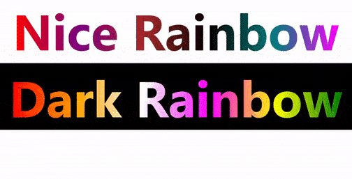

# React Rainbow Text Generator

# Demo

<a href="https://github.com/purplevarun/rainbow-text-react/blob/main/assets/App.jsx">Code for Demo</a>

# Installation

## npm

        npm i rainbow-text-react

## yarn

        yarn add rainbow-text-react

# Usage

        import RainbowText from "rainbow-text-react";

        <RainbowText>
                hello world
        </RainbowText>

# Properties

### 1. fontSize : number (default 50)

### 2. colorMode : "light" or "dark" (default "light")
